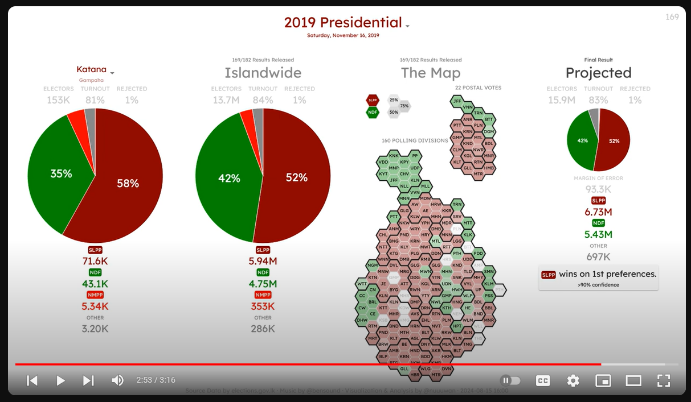
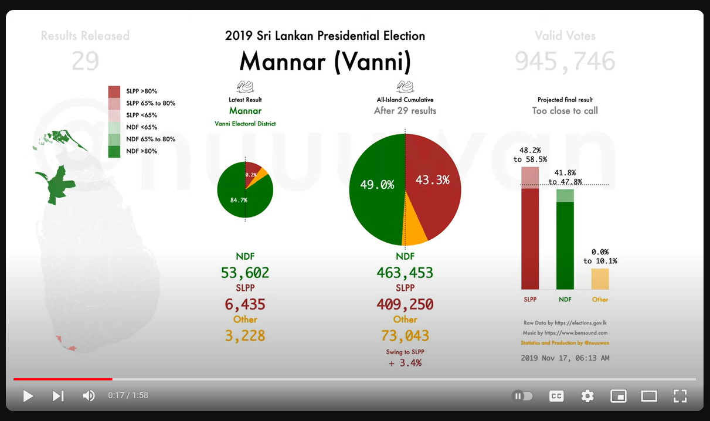
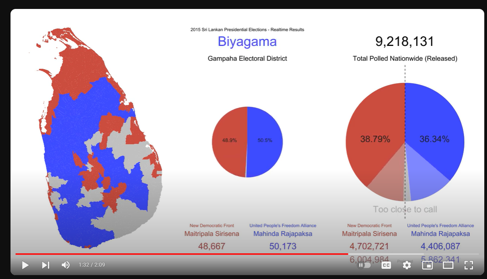
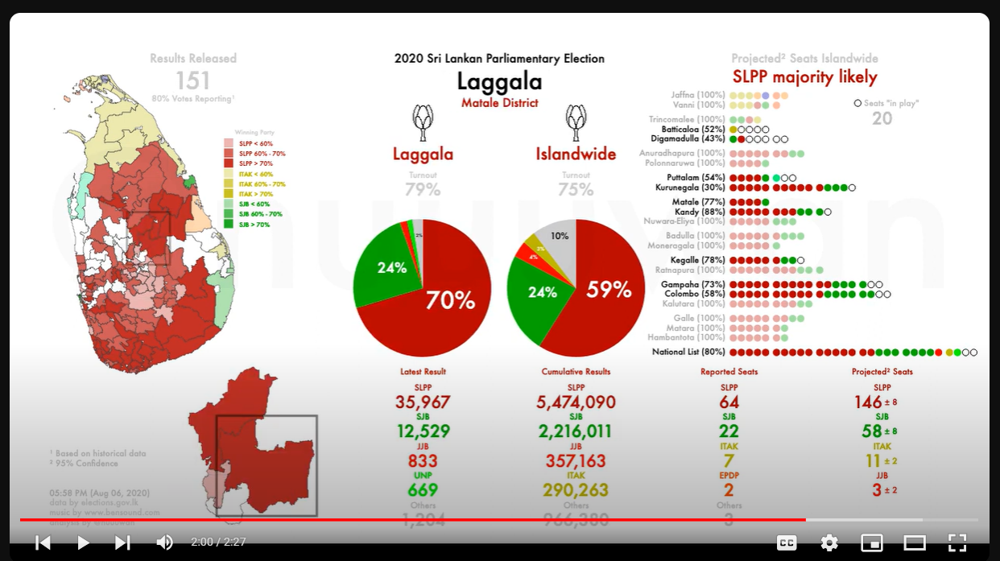
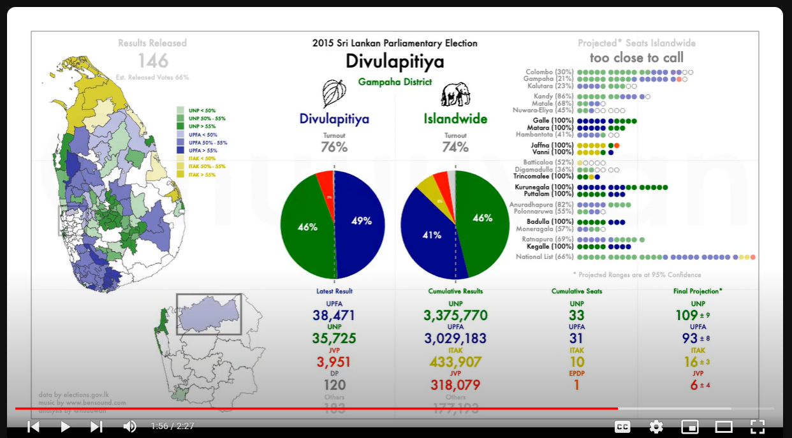
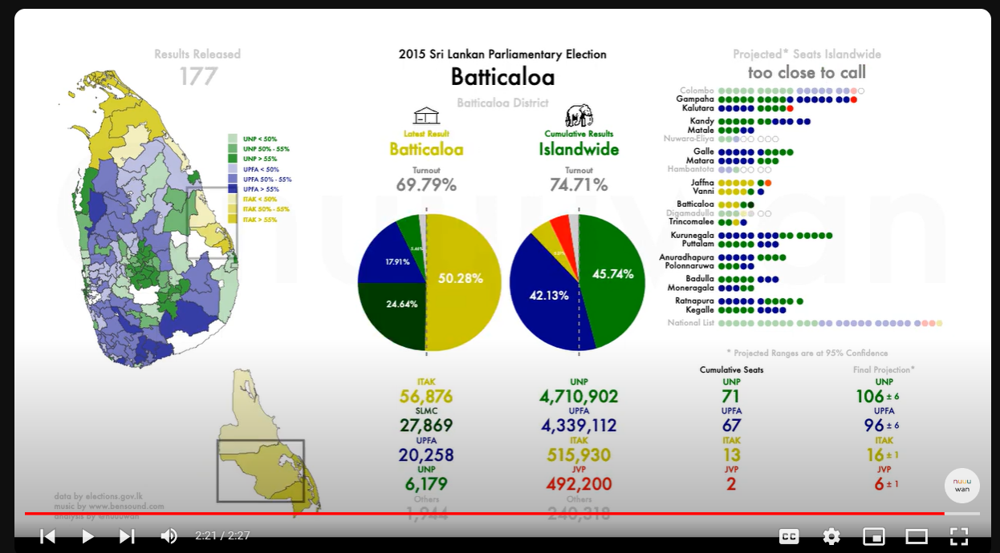

# Presidential Elections of Sri Lanka (#PresPollSL) App

## App

[https://nuuuwan.github.io/prespollsl2024/](https://nuuuwan.github.io/prespollsl2024/)

## TODOs

### Major

* Move to 3-column formal - which is more in line with Mobile

### Minor

* Estimate Rejected votes etc based on election of same kind. Otherwise they could be off.

### One Liners

* Change repo/app name to PresPollSL
* "Cumulative Total (56% released)"
* "Result #23 (Latest)"
* Replace number of votes with percentage ❓
* Replace humanized number of votes, with actual number of votes ❓

## Previous Designs

